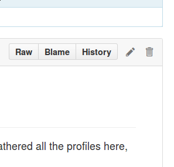
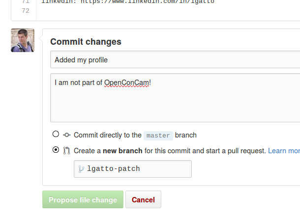

# OpenConCam membership

This file provides a short summary of the OpenConCam activists. (Once
we have gathered all the profiles here, we will use it to population
the main [OpenConCam](http://www.OpenConCam.org) web page.)

If you want to join OpenConCam, please feel free to add yourself. The
information we would like you to share is shown below. **Mandatory**
fields are *name*, *surname*, *short profile*, *open tags* and at
least one channel (email, twitter, ...) for people to contact you if
necessary. We would also like if you could provide 1 to 3 social media
accounts.

```
Name:  
Surname:  
Short profile:  
Open tags:  
www:  
email:  
twitter:  
GitHub:  
facebook:  
keybase:  
google+:  
linkedin:  
(add other social media)
```

## How to join

There are 3 possibilities to send us these information and join OpenConCam.

* The preferred way requires a free GitHub account and some
  familiarity for GitHub. Make sure you are logged in and click on the
  little pen on the upper right corner of this page.

  

  This will open an online editor for you to update this page using
  the simple
  [markdown syntax](https://guides.GitHub.com/features/mastering-markdown/). Start
  by copying the short form above at the bottom of this page and fill
  in the fields. Empty fields can either be left as is or removed
  completely. Then, scroll down to *commit* your changes but adding a
  short description of your update (`Update who.md`, the default
  message is file) and optionally add an extended description. You
  will then be able to *Create a new branch for this commit and start
  a pull request* by clicking on the `Propose file change` button.

  

   The admins of the repository will then receive an automated pull
   request that we will be able to review and merge into the main
   `who.md` page to include your change. 

   If you do it like this, you will have done your first official and
   public contribution to OpenConCam!

  (For additional GitHub help, please see their grep
  [help page](https://help.GitHub.com/).)

* If you have a GitHub but don't feel like sending a pull request as
  described above, just
  [open a public issue](https://github.com/OpenConCam/OpenConCam/issues)
  and copy/paste and fill our the information about in the issue. We
  will get notified that a new issue has been opened and can then add
  your profile to this page and then close the issue.


* Finally, if you do not have a GitHub account and don't want to
  create one for free, you can fill out this
  [Google form](http://goo.gl/forms/3IuGWXOZpZ). After submission, one
  administrator will be notified by email and they will update this
  page for you. This method might result in a few days delay before we
  can update your details.

## OpenConCam members

Name: Marta  
Surname: Teperek  
Short profile: Member of the
      [Open Data Team](http://www.data.cam.ac.uk/open-data-team) at
      the University of Cambridge. I did my PhD in biology and I am
      personally fascinated about open science. I would love open data
      and open science to become the default position everywhere, not
      only in certain disciplines.  If you have any suggestions of
      what the University of Cambridge might do to make data sharing
      easier, I would be delighted to hear from you.  
Open tags: Open data, open access, open science, open research, open mind :)  
www: www.data.cam.ac.uk  
email: info@data.cam.ac.uk  
twitter: @martateperek  
linkedin: https://uk.linkedin.com/in/mteperek  


Name: Laurent  
Surname: Gatto  
Short profile: Open science, bioinformatics, computational biology,
               proteomics, libre/open source, emacs, a lot of R and
               parenting.  
Open tags: Open data, open source software, open access, open education  
www: http://lgatto.GitHub.io  
twitter: @lgatt0  
GitHub: lgatto  
keybase: lgatto  
linkedin: https://www.linkedin.com/in/lgatto


Name: Keren  
Surname: Limor-Waisberg  
Short profile: Enabling scientific literacy and promote a more
	           accessible, inclusive, and collaborative science.  
Open tags:  
www: Literacytool.com  
email: keren@literacytool.com  
twitter: @TheLiteracyTool  
GitHub: KerenLW  
facebook: theliteracytool  
linkedin: http://uk.linkedin.com/in/kerenlimorwaisberg  
